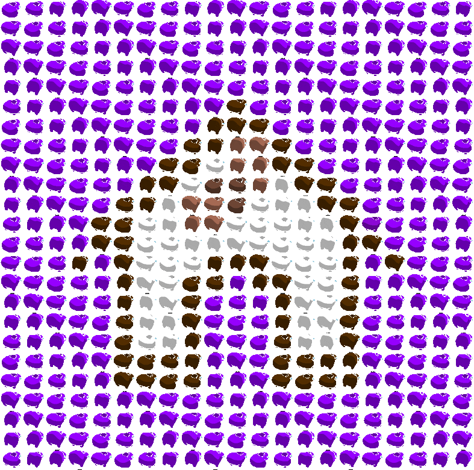

<div align="center">
  
</div>

# Rusty Sussy
A version of the `to_sus` from [Discord Sus Bot](https://github.com/eeibevan/discord-sus-bot).
May be run on its own, or with the [Bone Bot](https://github.com/The-Dogghouse/bone-bot).
Slightly ~~less~~ more likely to get me made fun of.

Putting the language name in your project is cringe
but I couldn't pass on this one.

## Usage
### Requirements
* Rust (Some version or whatever, IDK)
* [GifSki](https://gif.ski/)

### Basic usage
```shell
rusty-sussy --input=path/to/input/image.png --output=output/path.gif
```

### Full Usage
```shell
rusty-sussy [OPTIONS] --input <INPUT> --output <OUTPUT>
```

#### Options
`-i`, `--input`: Path to an input image, accepts common image types [jpg, png, etc..]

`-o`, `--output`: Path to place the resulting GIF

`-h`, `--help`: Prints help and usage info

`-V`. `--version`: Prints version info (Capital V for suffering)